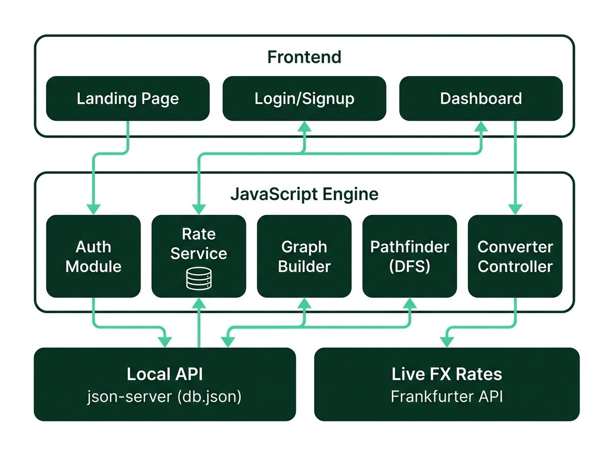
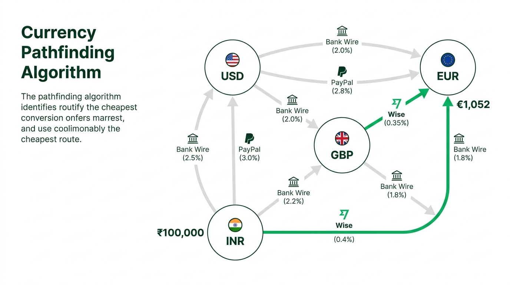

<div align="center">

# 💱 Bypass-FX

### _Find the cheapest path to convert your money — across providers, across currencies._


[](https://developer.mozilla.org/en-US/docs/Web/JavaScript)
[](https://api.frankfurter.app)
[](https://github.com/typicode/json-server)
[](LICENSE)

---

**Bypass-FX** is a fintech web application that doesn't just convert currencies — it finds the **cheapest conversion route** across multiple transfer providers (Wise, PayPal, Bank Wire) using live exchange rates and a **graph-based pathfinding algorithm**. Think of it as Google Maps, but for your money.

[🚀 Getting Started](#-getting-started) · [✨ Features](#-features) · [🏗️ Architecture](#️-architecture) · [📂 Project Structure](#-project-structure) · [🧠 How It Works](#-how-it-works) · [🛡️ Security Notes](#️-security-notes)

</div>

---

## 📋 Table of Contents

- [Features](#-features)
- [Demo Preview](#-demo-preview)
- [Getting Started](#-getting-started)
  - [Prerequisites](#prerequisites)
  - [Installation](#installation)
  - [Running the Project](#running-the-project)
- [Architecture](#️-architecture)
- [Project Structure](#-project-structure)
- [How It Works](#-how-it-works)
  - [The Pathfinding Algorithm](#1-the-pathfinding-algorithm)
  - [Live Exchange Rates](#2-live-exchange-rates)
  - [Provider Fee Models](#3-provider-fee-models)
  - [Authentication Flow](#4-authentication-flow)
- [API Endpoints](#-api-endpoints)
- [Supported Currencies](#-supported-currencies)
- [Tech Stack](#-tech-stack)
- [Security Notes](#️-security-notes)
- [Roadmap](#-roadmap)
- [Contributing](#-contributing)
- [License](#-license)

---

## ✨ Features

| Feature | Description |
|---------|-------------|
| 🔍 **Smart Pathfinding** | Graph-based DFS algorithm finds the cheapest multi-hop conversion route across 3 providers |
| 📊 **Live Exchange Rates** | Real-time mid-market rates from the [Frankfurter API](https://api.frankfurter.app) with 15-minute local caching |
| 💰 **Multi-Provider Comparison** | Compares Wise (0.5%), PayPal (3.5%), and Bank Wire (1% + $20 fixed) side-by-side |
| 📈 **Live Rate Ticker** | Animated marquee showing real-time currency pair movements with ▲/▼ indicators |
| 🔐 **Full Auth System** | Sign up, log in, forgot password, session management, and route guards |
| 💾 **Conversion History** | Every conversion is saved and displayed in "Recent Conversions" (persisted to `db.json`) |
| 🎨 **Premium UI** | Glassmorphism, fluid typography, responsive design, and dark forest green fintech aesthetic |
| ♿ **Accessible** | ARIA attributes on custom dropdowns, `prefers-reduced-motion` support, semantic HTML5 |
| 🛡️ **XSS Protected** | User inputs are escaped via `escapeHtml()` before DOM insertion |

---

## 🖼️ Demo Preview

### Landing Page
The landing page features a real-time currency ticker, an interactive FX calculator, a 4-step algorithm breakdown, and a supported currency catalog — all without needing to log in.

### Dashboard (Authenticated)
After logging in, the dashboard lets you run conversions, see the cheapest multi-hop route visualized step-by-step, and view your last 5 conversion results saved to the server.

---

## 🚀 Getting Started

### Prerequisites

Before you begin, make sure you have:

- **[Node.js](https://nodejs.org/)** (v14 or higher) — for running `json-server`
- **npm** — comes bundled with Node.js
- A **modern web browser** (Chrome, Firefox, Edge, Safari)

### Installation

**1. Clone the repository**

```bash
git clone https://github.com/your-username/Bypass-FX.git
cd Bypass-FX
```

**2. Install dependencies**

```bash
npm install
```

This installs `json-server` (the only dependency), which serves `db.json` as a full REST API.

### Running the Project

You need **two terminals** running side by side:

**Terminal 1 — Start the API server**

```bash
npm start
```

This runs `json-server --watch db.json --port 3000`, which:
- Watches `db.json` for changes
- Serves it as a REST API at `http://localhost:3000`
- Provides endpoints for `/users` and `/conversions`

You should see:

```
  \{^_^}/ hi!

  Loading db.json
  Done

  Resources
  http://localhost:3000/users
  http://localhost:3000/conversions

  Home
  http://localhost:3000
```

**Terminal 2 — Serve the frontend**

```bash
npx serve .
```

> ⚠️ **Important:** You must serve the frontend through an HTTP server. Opening `index.html` directly via `file://` will **not work** because the app uses ES Modules (`type="module"`), which browsers block over the `file://` protocol.

Open the URL that `serve` gives you (usually `http://localhost:3000` or `http://localhost:5000`).

### Quick Walkthrough

1. **Visit the landing page** (`index.html`) — explore the live ticker, try the FX calculator
2. **Sign up** on `signup.html` — your account is saved to `db.json` instantly
3. **Log in** on `login.html` with your email and password
4. **Use the dashboard** — convert currencies, e.g., `INR → EUR`, amount `100000`
5. **See the magic** — the pathfinder shows the cheapest route, provider fees, and savings vs. direct conversion
6. **Check `db.json`** — your conversion is saved under the `conversions` array

---

## 🏗️ Architecture



The application follows a **3-layer architecture**:

### Layer 1 — Frontend UI
Five HTML pages handle all user interactions:

| Page | Purpose |
|------|---------|
| `index.html` | Marketing landing page with live ticker & embedded FX calculator |
| `login.html` | Two-panel login with brand storytelling + auth form |
| `signup.html` | Registration with client-side validation & terms modal |
| `forgot-password.html` | Multi-step password reset (email verify → new password) |
| `dashboard.html` | Authenticated converter with route visualization & history |

### Layer 2 — JavaScript Engine
Eight modular JS files power all logic:

| Module | Type | Responsibility |
|--------|------|----------------|
| `auth.js` | IIFE Script | Login, signup, forgot password, sessions, logout |
| `ticker.js` | ES Module | Live animated rate ticker (polls every 3 min) |
| `rateService.js` | ES Module | Cache-aware Frankfurter API client (15-min TTL) |
| `graphBuilder.js` | ES Module (Pure) | Converts rates + providers → weighted adjacency graph |
| `pathfinder.js` | ES Module (Pure) | DFS search to find the cheapest multi-hop path |
| `providers.js` | ES Module (Data) | Static fee configs for Wise, PayPal, Bank Wire |
| `converter.js` | ES Module | Dashboard controller — wires UI ↔ engine ↔ API |
| `home.js` | Standalone Script | Drives the landing page (index.html) |

### Layer 3 — Backend & Data

| Service | Role |
|---------|------|
| **json-server** (port 3000) | Watches `db.json`, provides REST endpoints for `/users` and `/conversions` |
| **Frankfurter API** | Free, public API providing live mid-market exchange rates (no API key needed) |

---

## 📂 Project Structure

```
Bypass-FX/
│
├── 📄 index.html                 # Landing page — marketing + live FX calculator
├── 📄 login.html                 # Login page — two-panel split layout
├── 📄 signup.html                # Sign up page — with validation & terms modal
├── 📄 forgot-password.html       # Password reset — multi-step email → new password
├── 📄 dashboard.html             # Auth'd dashboard — converter + conversion history
│
├── 📁 js/
│   ├── 🔐 auth.js               # Authentication & session management (IIFE)
│   ├── 📊 ticker.js              # Live rate ticker animation (ES Module)
│   ├── 🌐 rateService.js         # Frankfurter API client + localStorage cache
│   ├── 🔗 graphBuilder.js        # Pure: rates → weighted multi-edge graph
│   ├── 🧭 pathfinder.js          # Pure: DFS forward-amount pathfinding
│   ├── 💳 providers.js           # Static fee configs (Wise, PayPal, Wire)
│   ├── ⚙️ converter.js           # Dashboard controller (UI ↔ engine ↔ API)
│   └── 🏠 home.js                # Landing page controller (standalone)
│
├── 📁 css/
│   ├── 🎨 style.css              # Auth pages + dashboard styles (624 lines)
│   └── 🎨 home.css               # Landing page design system (2,514 lines)
│
├── 📁 assets/
│   ├── 🖼️ logo.svg               # Brand icon — 64×64 SVG
│   ├── 🖼️ hero-banner.jpg        # README hero image
│   ├── 🖼️ architecture-diagram.jpg # Architecture diagram
│   └── 🖼️ pathfinding-demo.jpg   # Pathfinding algorithm visualization
│
├── 📦 db.json                    # json-server database (users + conversions)
├── 📦 package.json               # npm config — json-server dependency
├── 📦 package-lock.json          # Dependency lock file
└── 📖 README.md                  # You are here!
```

---

## 🧠 How It Works

### 1. The Pathfinding Algorithm



This is the core innovation of Bypass-FX. Instead of simply converting `INR → EUR` directly, the engine explores **multi-hop routes** through intermediate "hub" currencies to find the cheapest path.

**How it works step-by-step:**

```
Example: Converting ₹100,000 INR → EUR

Step 1: Build a graph
   - Nodes: INR, EUR, USD, GBP, JPY (source + target + hub currencies)
   - Edges: Every currency pair × every provider = multi-edge weighted graph

Step 2: DFS pathfinding (with max hops)
   - Try: INR → EUR (direct via Wise)           = €1,048
   - Try: INR → USD → EUR (via Wise + Wise)     = €1,052  ← BEST
   - Try: INR → GBP → EUR (via Wise + PayPal)   = €1,039
   - Try: INR → USD → GBP → EUR (3 hops)        = €1,044
   ... and many more combinations

Step 3: Return the best, runner-up, and direct routes
   - Best:     INR → USD → EUR via Wise     = €1,052 (+€4 vs direct)
   - Direct:   INR → EUR via Wise            = €1,048
   - Savings:  €4 saved by taking the bypass route!
```

**Why not Dijkstra?**
Traditional shortest-path algorithms assume edge weights are scale-invariant. But Bank Wire charges a **$20 fixed fee** per hop — so the cost of a hop depends on the amount arriving at it. Bypass-FX solves this by **simulating the actual amount forward** through each candidate path.

**Key files:**
- [`graphBuilder.js`](js/graphBuilder.js) — Pure function: `(rates, providers) → adjacency list`
- [`pathfinder.js`](js/pathfinder.js) — Pure function: `(graph, from, to, amount, maxHops) → { best, runnerUp, direct }`

### 2. Live Exchange Rates

The [`rateService.js`](js/rateService.js) module fetches live mid-market rates from the **Frankfurter API** with a smart caching strategy:

```
1. Check localStorage for cached rates (key: bypassfx:rates:<BASE>)
2. If cache is fresh (< 15 minutes old) → use cached data
3. If cache is stale or missing → fetch from https://api.frankfurter.app
4. If fetch fails → fall back to stale cache (graceful degradation)
5. Parallel batch fetching via Promise.all for multiple base currencies
```

This prevents rate-limit exhaustion and keeps the app fast even on flaky networks.

### 3. Provider Fee Models

Three real-world-inspired transfer providers are simulated in [`providers.js`](js/providers.js):

| Provider | Percentage Fee | Fixed Fee | Best For |
|----------|---------------|-----------|----------|
| 🟢 **Wise** | 0.5% | $0 | Small & medium transfers |
| 🔵 **PayPal** | 3.5% | $0 | Convenience (but expensive) |
| 🟤 **Bank Wire** | 1.0% | $20 | Large transfers (fixed fee amortized) |

Hub currencies used for intermediate routing: **USD**, **EUR**, **GBP**, **JPY**

### 4. Authentication Flow

```
┌─────────────┐     GET /users?email=...      ┌──────────────┐
│   SIGN UP   │ ──── check duplicate ────────→ │              │
│  signup.html │                                │  json-server │
│             │ ──── POST /users ────────────→ │   :3000      │
└─────────────┘     create account              │              │
                                                │   db.json    │
┌─────────────┐     GET /users?email&password   │              │
│    LOG IN   │ ──── match credentials ──────→ │  /users      │
│  login.html │                                │  /conversions│
│             │ ←─── user object ────────────  │              │
└─────────────┘     store in session            └──────────────┘
       │
       ▼
  localStorage (Remember Me ✓)
  sessionStorage (Remember Me ✗)
  key: "bypassfx_session"
       │
       ▼
┌─────────────┐
│  DASHBOARD  │  ← Guard script in <head> redirects
│dashboard.html│    unauthorized visitors before paint
└─────────────┘
```

- **Session data stored:** `id`, `name`, `email`, `joinedDate` (never the password)
- **Logout:** Clears session from storage, redirects to `login.html`
- **Forgot password:** Verifies email exists → directly patches new password via `PATCH /users/:id`

---

## 🔌 API Endpoints

All endpoints are served by `json-server` at `http://localhost:3000`:

| Method | Endpoint | Purpose |
|--------|----------|---------|
| `GET` | `/users?email=...` | Check if email exists (signup duplicate check) |
| `GET` | `/users?email=...&password=...` | Authenticate user (login) |
| `POST` | `/users` | Create new user account |
| `PATCH` | `/users/:id` | Update user password (forgot password) |
| `GET` | `/conversions?userId=...&_sort=createdAt&_order=desc&_limit=5` | Fetch recent conversions |
| `POST` | `/conversions` | Save a new conversion result |

**External API:**

| Method | Endpoint | Purpose |
|--------|----------|---------|
| `GET` | `https://api.frankfurter.app/latest?from=BASE` | Fetch live exchange rates for a base currency |

---

## 🌍 Supported Currencies

The converter supports **10 major global currencies**:

| Code | Currency | Code | Currency |
|------|----------|------|----------|
| 🇺🇸 USD | US Dollar | 🇯🇵 JPY | Japanese Yen |
| 🇪🇺 EUR | Euro | 🇨🇦 CAD | Canadian Dollar |
| 🇬🇧 GBP | British Pound | 🇦🇺 AUD | Australian Dollar |
| 🇮🇳 INR | Indian Rupee | 🇨🇭 CHF | Swiss Franc |
| 🇸🇬 SGD | Singapore Dollar | 🇦🇪 AED | UAE Dirham |

Hub currencies used for intermediate hops: **USD**, **EUR**, **GBP**, **JPY**

---

## 🛠️ Tech Stack

| Layer | Technology |
|-------|-----------|
| **Frontend** | Vanilla HTML5, CSS3, ES Modules — zero frameworks |
| **Styling** | Custom design system with CSS tokens, glassmorphism, `clamp()` fluid typography |
| **Backend** | [json-server](https://github.com/typicode/json-server) `^0.17.4` — zero-code REST API |
| **Live Rates** | [Frankfurter API](https://api.frankfurter.app) — free, no API key required |
| **Fonts** | [Space Grotesk](https://fonts.google.com/specimen/Space+Grotesk) (display) · [Inter](https://fonts.google.com/specimen/Inter) (body) |
| **Icons** | Inline SVG |
| **Package Manager** | npm |

---

## 🛡️ Security Notes

> ⚠️ **This project is built for learning and prototyping.** It is NOT production-ready.

| Concern | Current State | Production Fix |
|---------|--------------|----------------|
| Passwords | Stored as **plain text** in `db.json` | Hash with bcrypt before storing |
| Authentication | Client-side `GET` with email + password in query string | Use a real backend with JWT/OAuth tokens |
| Password Reset | Direct `PATCH` without email verification | Implement token-based email verification |
| Session | Stored in `localStorage`/`sessionStorage` | Use HTTP-only secure cookies |
| API | No rate limiting, no CORS restrictions | Add rate limiting, CORS whitelist, HTTPS |

**Upgrading to production** would only require changing the `fetch` calls in `js/auth.js` and `js/converter.js` — the HTML, CSS, and converter engine remain untouched.

---

## 🗺️ Roadmap

- [ ] 🔒 Add bcrypt password hashing with a real backend (Express.js / Fastify)
- [ ] 🪙 Add cryptocurrency support (BTC, ETH, USDT)
- [ ] 📱 Progressive Web App (PWA) with offline support
- [ ] 📊 Conversion analytics dashboard with charts
- [ ] 🌙 Dark mode toggle
- [ ] 🔔 Rate alert notifications
- [ ] 🧪 Unit tests for `graphBuilder.js` and `pathfinder.js`
- [ ] 🐳 Docker Compose setup for one-command deployment

---

## 🤝 Contributing

Contributions are welcome! Here's how:

1. **Fork** the repository
2. **Create** a feature branch: `git checkout -b feature/amazing-feature`
3. **Commit** your changes: `git commit -m 'Add amazing feature'`
4. **Push** to the branch: `git push origin feature/amazing-feature`
5. **Open** a Pull Request

---

## 📄 License

This project is open source and available under the [MIT License](LICENSE).

---

<div align="center">

**Built with ❤️ by [Saksham Sood](https://github.com/Sakshamsoodcoder)**

_If you found this useful, consider giving it a ⭐!_

</div>
