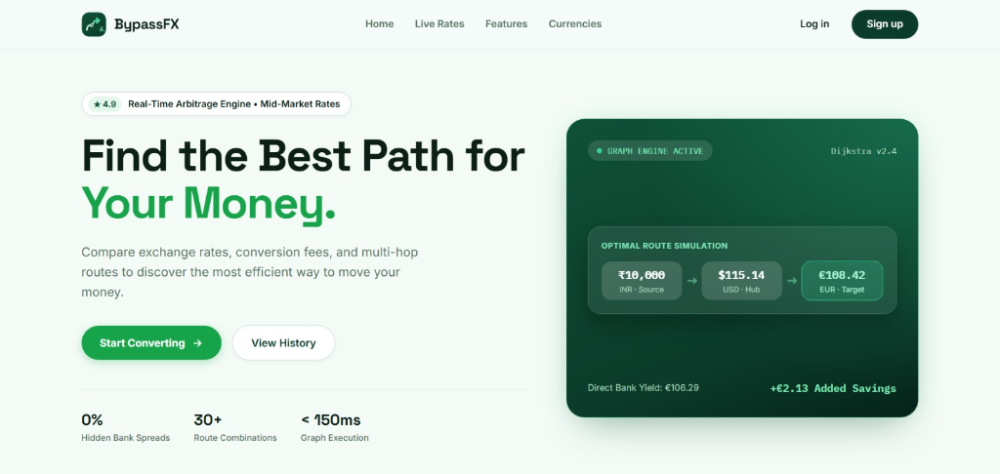
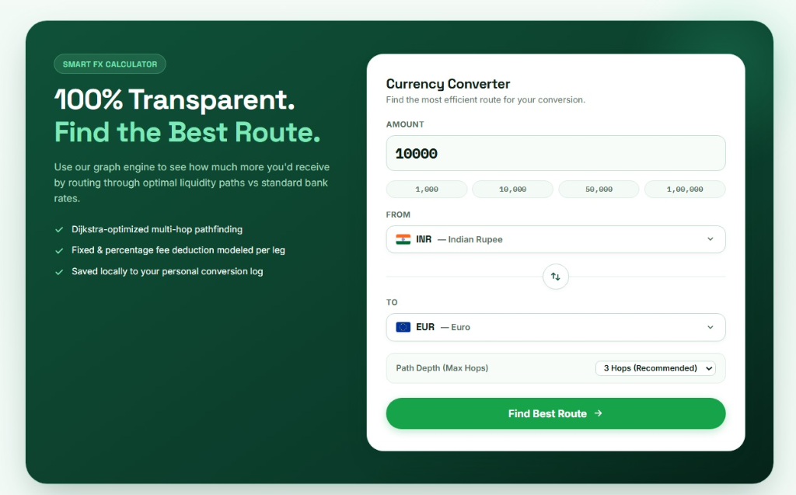
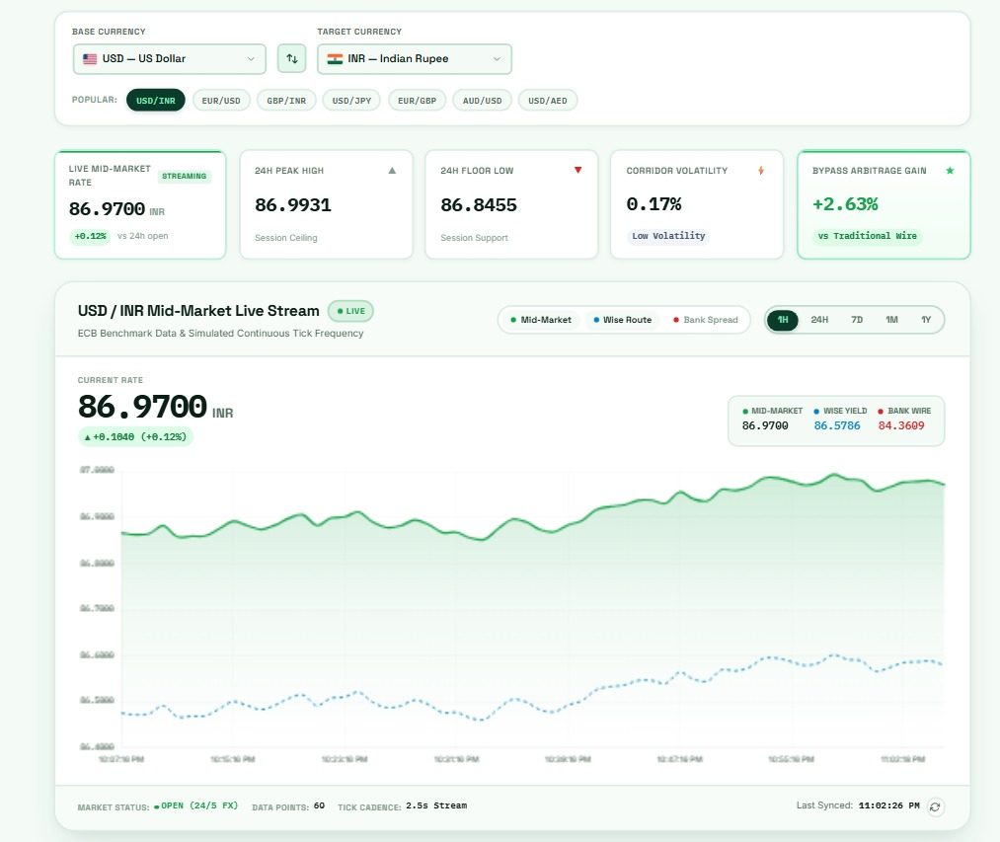
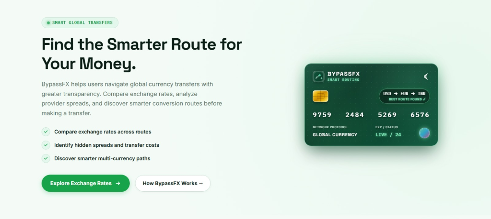

<div align="center">


# Bypass-FX

### _Find the cheapest path to convert your money -- across providers, across currencies._

[](https://developer.mozilla.org/en-US/docs/Web/JavaScript)
[](https://api.frankfurter.app)
[](https://vercel.com/)
[](LICENSE)

---

**Bypass-FX** is a fintech web application designed to find the **cheapest conversion route** across multiple transfer providers (Wise, PayPal, Bank Wire) using live exchange rates and a graph-based pathfinding algorithm. Think of it as Google Maps, but for your money.

[Getting Started](#getting-started) | [Features](#features) | [Screenshots](#screenshots) | [Architecture](#architecture) | [Project Structure](#project-structure)

</div>

---

## Table of Contents

- [Features](#features)
- [Screenshots](#screenshots)
- [Getting Started](#getting-started)
- [Architecture](#architecture)
- [Project Structure](#project-structure)
- [Authentication Flow](#authentication-flow)
- [API Endpoints](#api-endpoints)
- [Tech Stack](#tech-stack)
- [License](#license)

---

## Features

| Feature | Description |
|---------|-------------|
| **Live Exchange Rates** | Real-time mid-market rates from the [Frankfurter API](https://api.frankfurter.app) |
| **Live Rate Ticker** | Animated marquee showing real-time currency pair movements with up/down indicators |
| **Smart FX Calculator** | Dijkstra-optimized multi-hop pathfinding across currency pairs and providers |
| **Live Chart Studio** | Interactive streaming charts with 1H, 24H, 7D, 1M, 1Y timeframes and live tick simulation |
| **Mock Auth System** | Sign up, log in, forgot password, and session management via browser localStorage |
| **Premium UI** | Glassmorphism, fluid typography, responsive design, and dark forest green fintech aesthetic |
| **Fully Responsive** | Flexbox and CSS Grid layout seamlessly scales across desktop, tablet, and mobile breakpoints |

---

## Screenshots

### Landing Page -- Hero Section
The hero section introduces BypassFX with an animated route simulation card showing a live INR to USD to EUR optimal path, along with key product metrics.



---

### Smart FX Calculator
The converter section features a two-panel layout: a marketing panel explaining the graph engine on the left, and a fully interactive currency converter form on the right with amount presets, currency selectors, and configurable hop depth.



---

### Live Market Rate Studio
The rates page delivers a full-featured chart studio with live streaming USD/INR mid-market data, 24H peak/floor metrics, corridor volatility stats, bypass arbitrage gain indicators, and multi-provider overlay comparison (Mid-Market vs Wise vs Bank Wire).



---

### Smart Global Transfers
A feature showcase section highlighting BypassFX's smart routing capabilities with a credit-card-style visual showing a live best-route discovery across USD, EUR, and INR.



---

## Getting Started

### Prerequisites

You only need a **modern web browser** and a basic local HTTP server (like VS Code Live Server, or `npx serve`) to run this project locally.

### Running the Project

Because the project uses modern ES Modules (`type="module"`), you cannot simply double-click `index.html` (the browser will block the scripts due to CORS).

**1. Serve the frontend**

```bash
npx serve .
```
*(Or use the "Go Live" button if you use the Live Server extension in VS Code).*

**2. Open your browser**
Go to `http://localhost:3000` (or whatever port your local server provides).

### Quick Walkthrough

1. **Visit the landing page** (`index.html`) -- explore the live ticker and converter UI.
2. **Sign up** on `signup.html` -- your account is saved to your browser's localStorage.
3. **Log in** on `login.html` with your email and password.
4. **Explore Live Rates** on `rates.html` -- view streaming charts and market data.
5. **Visit your profile** -- navigate to `profile.html` to see your user stats.

---

## Architecture

The application follows a **3-layer architecture** optimized for static serverless deployment on Vercel:

```
+---------------------------------------------------------------------+
|                        LAYER 1 -- FRONTEND UI                       |
|                                                                     |
|  index.html    login.html    signup.html    forgot-password.html    |
|  rates.html    profile.html                                         |
|                                                                     |
|  CSS Design System: home.css | style.css | rates.css | profile.css  |
+---------------------------------------------------------------------+
          |                    |                    |
          v                    v                    v
+---------------------------------------------------------------------+
|                     LAYER 2 -- JAVASCRIPT ENGINE                    |
|                                                                     |
|  auth.js          Authentication & localStorage mock database       |
|  home.js          Landing page interactions & mobile nav             |
|  ticker.js        Live animated rate ticker (ES Module)             |
|  rateService.js   Frankfurter API client with localStorage cache    |
|  charts.js        Chart.js streaming engine for rates page          |
|  profile.js       Profile page session rendering & stats            |
+---------------------------------------------------------------------+
          |                                        |
          v                                        v
+-------------------------------+  +-------------------------------+
|    LAYER 3a -- LOCAL DATA     |  |   LAYER 3b -- EXTERNAL API    |
|                               |  |                               |
|  localStorage                 |  |  Frankfurter API              |
|  +- bypassfx_users_db        |  |  api.frankfurter.app          |
|  +- bypassfx_session         |  |                               |
|  +- bypassfx_history         |  |  Free, no API key required    |
|  +- bypassfx:rates:<BASE>    |  |  Live mid-market exchange     |
|                               |  |  rates (ECB benchmark)       |
+-------------------------------+  +-------------------------------+
```

### Layer 1 -- Frontend UI
Six responsive HTML pages handle all user interactions:

| Page | Purpose |
|------|---------|
| `index.html` | Marketing landing page with live ticker, converter UI, and feature showcases |
| `login.html` | Two-panel login with brand storytelling + auth form |
| `signup.html` | Registration with client-side validation |
| `forgot-password.html` | Multi-step password reset (email verify -> new password) |
| `rates.html` | Live rate chart studio with streaming data and corridor analytics |
| `profile.html` | Authenticated user profile and session dashboard |

### Layer 2 -- JavaScript Engine
Modular JS files power all client-side logic:

| Module | Responsibility |
|--------|----------------|
| `auth.js` | Login, signup, forgot password, sessions, and localStorage mock database |
| `home.js` | Landing page layout interactions, mobile nav drawer, navbar auth state |
| `ticker.js` | Live animated rate ticker polling Frankfurter API every 3 minutes |
| `rateService.js` | Cache-aware Frankfurter API client with 15-minute TTL in localStorage |
| `charts.js` | Chart.js-powered streaming rate charts with live tick simulation |
| `profile.js` | Profile page session rendering, user stats, and live rate widget |

### Layer 3 -- Data Layer

| Service | Role |
|---------|------|
| **localStorage** | Browser-native storage for user accounts, sessions, rate cache, and conversion history |
| **Frankfurter API** | Free, public API providing live mid-market exchange rates from ECB benchmark data |

---

## Project Structure

```
Bypass-FX/
|
|-- index.html                 # Landing page with hero, converter, features
|-- login.html                 # Login page
|-- signup.html                # Sign up page
|-- forgot-password.html       # Password reset
|-- rates.html                 # Live Market Rates chart studio
|-- profile.html               # Authenticated user profile
|
|-- js/
|   |-- auth.js                # Authentication & session management (localStorage)
|   |-- home.js                # Landing page controller & navbar auth
|   |-- ticker.js              # Live rate ticker animation (ES Module)
|   |-- rateService.js         # Frankfurter API client + localStorage cache
|   |-- charts.js              # Chart.js streaming engine for rates page
|   |-- profile.js             # Profile page session & stats rendering
|
|-- css/
|   |-- home.css               # Landing page design system (2500+ lines)
|   |-- style.css              # Auth pages + base styles
|   |-- rates.css              # Rates page chart studio styles
|   |-- profile.css            # Profile page styles
|
|-- assets/
|   |-- logo.svg               # Brand icon
|   |-- screenshot-hero.png    # Landing page screenshot
|   |-- screenshot-converter.png # Converter section screenshot
|   |-- screenshot-rates.png   # Rates page screenshot
|   |-- screenshot-features.png # Features section screenshot
|
|-- README.md                  # You are here!
```

---

## Authentication Flow

Authentication is fully mocked using the browser's native localStorage to enable seamless hosting on Vercel without a dedicated backend server.

```
  SIGNUP                          LOGIN                         SESSION
  ------                          -----                         -------

  User fills form          User enters credentials        On every page load
       |                          |                             |
       v                          v                             v
  Validate inputs          Validate inputs              Read bypassfx_session
       |                          |                      from localStorage
       v                          v                             |
  Check bypassfx_users_db   Check bypassfx_users_db     +------+------+
  for duplicate email        for email + password match  |             |
       |                          |                    Found        Missing
       v                          v                      |             |
  Push new user object       Save user to session     Show user     Redirect to
  to users array             (localStorage or         badge in      login.html
       |                    sessionStorage)            navbar
       v                          |
  Auto-login user                 v
  Redirect to index.html    Redirect to index.html
```

- **Storage Key:** `bypassfx_users_db` (Array of user objects)
- **Session Key:** `bypassfx_session` (Currently logged-in user)
- **Security Note:** Passwords are saved in plain text in localStorage. This is strictly for demonstration purposes. A production app would require a real backend with hashed passwords.

---

## API Endpoints

**External Data API:**

| Method | Endpoint | Purpose |
|--------|----------|---------|
| `GET` | `https://api.frankfurter.app/latest?from=BASE` | Fetch live exchange rates for a base currency |
| `GET` | `https://api.frankfurter.app/START..END?from=BASE&to=TARGET` | Fetch historical rate timeseries |

---

## Tech Stack

| Layer | Technology |
|-------|-----------|
| **Frontend** | Vanilla HTML5, CSS3, ES Modules -- zero frameworks |
| **Styling** | Custom design system with CSS Grid/Flexbox, glassmorphism, `clamp()` typography |
| **Charts** | [Chart.js](https://www.chartjs.org/) for live streaming rate visualization |
| **Backend** | Serverless / localStorage (Vercel deployment compatible) |
| **Live Rates** | [Frankfurter API](https://api.frankfurter.app) -- free ECB benchmark data |
| **Fonts** | [Space Grotesk](https://fonts.google.com/specimen/Space+Grotesk) (display), [Inter](https://fonts.google.com/specimen/Inter) (body) |

---

## License

This project is open source and available under the [MIT License](LICENSE).

---

<div align="center">

**Built by Saksham Sood, Kartik Verma, and Kartik Sharma**

_If you found this useful, consider giving it a star!_

</div>
